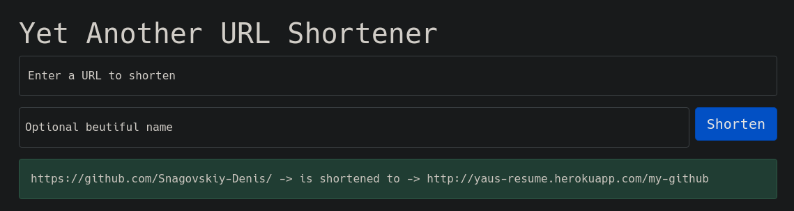

# YAUS



Shorten URL address to one with given name. If no name provided, assign the base 62 entry ID as the URL name.

YAUS has an API by path `/api`. POST arguments: `url` is a URL to be shortened and `name` is an optional custom URL name.

Live preview is available on: https://yaus-resume.herokuapp.com/


# How to run

With project inside docker container:

```
docker-compose up
```


With project outside docker container:

```
docker-compose -f docker-compose-dev.yml up -d
python -m venv ./venv 
source ./venv/bin/activate 
pip install -r requirements.txt
./manage.py migrate
./manage.py runserver
```
